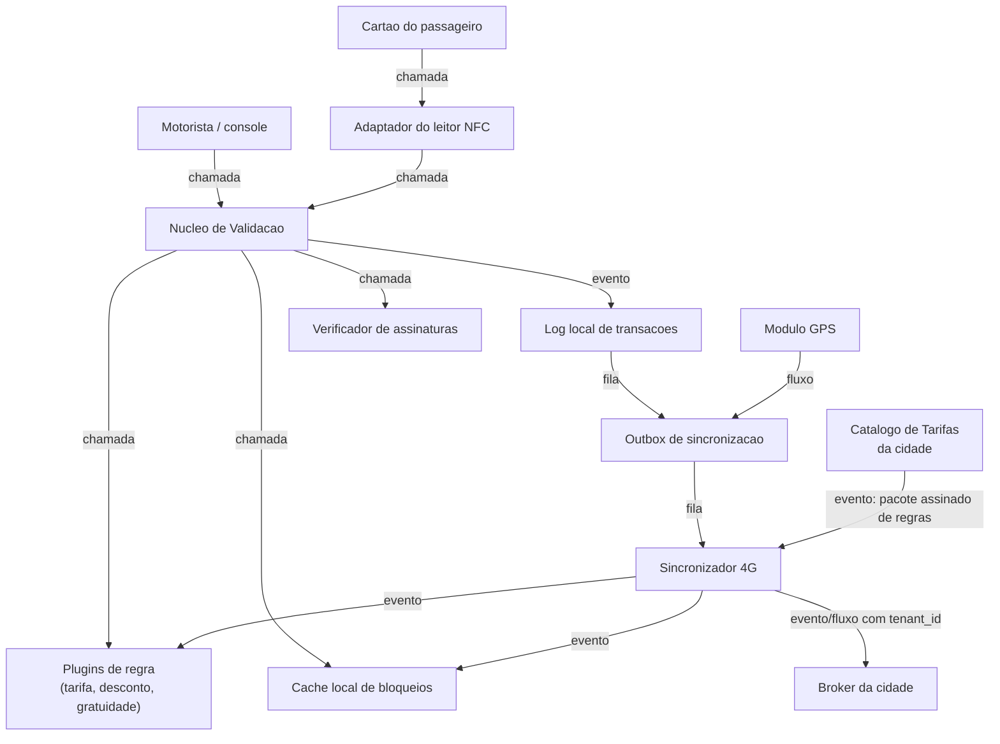

# C4 - Componentes do Validador Embarcado

```mermaid
flowchart TB
    cartao["Cartao do passageiro"]
    motorista["Motorista / console"]
    gps["Modulo GPS"]

    leitor["Adaptador do leitor NFC"]
    regraCore["Nucleo de Validacao"]
    plugins["Plugins de regra\n(tarifa, desconto, gratuidade)"]
    bloqueios["Cache local de bloqueios"]
    transacoes["Log local de transacoes"]
    outbox["Outbox de sincronizacao"]
    sync["Sincronizador 4G"]
    assinatura["Verificador de assinaturas"]

    broker["Broker da cidade"]
    catalogo["Catalogo de Tarifas\nda cidade"]

    cartao -- "chamada" --> leitor
    motorista -- "chamada" --> regraCore
    leitor -- "chamada" --> regraCore
    regraCore -- "chamada" --> plugins
    regraCore -- "chamada" --> bloqueios
    regraCore -- "chamada" --> assinatura
    regraCore -- "evento" --> transacoes
    transacoes -- "fila" --> outbox
    gps -- "fluxo" --> outbox
    outbox -- "fila" --> sync
    sync -- "evento/fluxo com tenant_id" --> broker
    catalogo -- "evento: pacote assinado de regras" --> sync
    sync -- "evento" --> bloqueios
    sync -- "evento" --> plugins
```
