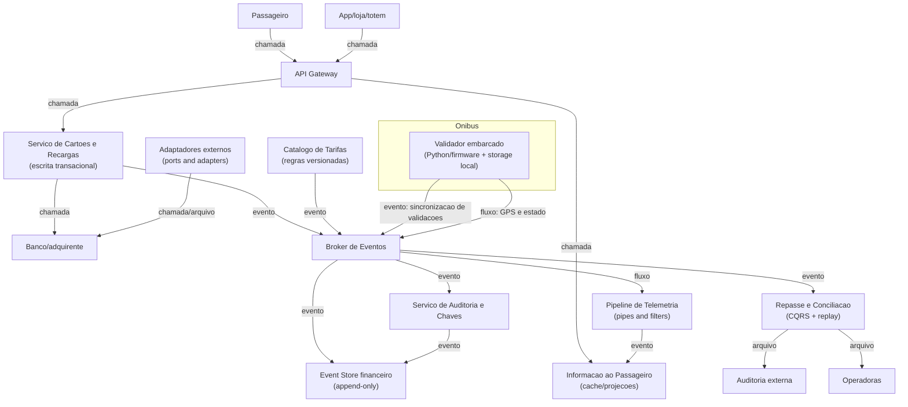

# C4 - Conteineres

```mermaid
flowchart TB
    passageiro["Passageiro"]
    recargaExterna["App/loja/totem"]
    banco["Banco/adquirente"]
    operador["Operadoras"]
    auditoria["Auditoria externa"]

    subgraph onboard["Onibus"]
        validador["Validador embarcado\n(Python/firmware + storage local)"]
    end

    api["API Gateway"]
    cartoes["Servico de Cartoes e Recargas\n(escrita transacional)"]
    tarifas["Catalogo de Tarifas\n(regras versionadas)"]
    broker["Broker de Eventos"]
    eventstore["Event Store financeiro\n(append-only)"]
    telemetria["Pipeline de Telemetria\n(pipes and filters)"]
    passageiroInfo["Informacao ao Passageiro\n(cache/projecoes)"]
    repasse["Repasse e Conciliacao\n(CQRS + replay)"]
    integracoes["Adaptadores externos\n(ports and adapters)"]
    auditoriaSvc["Servico de Auditoria e Chaves"]

    passageiro -- "chamada" --> api
    recargaExterna -- "chamada" --> api
    api -- "chamada" --> cartoes
    api -- "chamada" --> passageiroInfo
    cartoes -- "chamada" --> banco
    cartoes -- "evento" --> broker
    tarifas -- "evento" --> broker
    validador -- "evento: sincronizacao de validacoes" --> broker
    validador -- "fluxo: GPS e estado" --> broker
    broker -- "evento" --> eventstore
    broker -- "fluxo" --> telemetria
    broker -- "evento" --> repasse
    telemetria -- "evento" --> passageiroInfo
    repasse -- "arquivo" --> auditoria
    repasse -- "arquivo" --> operador
    integracoes -- "chamada/arquivo" --> banco
    broker -- "evento" --> auditoriaSvc
    auditoriaSvc -- "evento" --> eventstore
```
