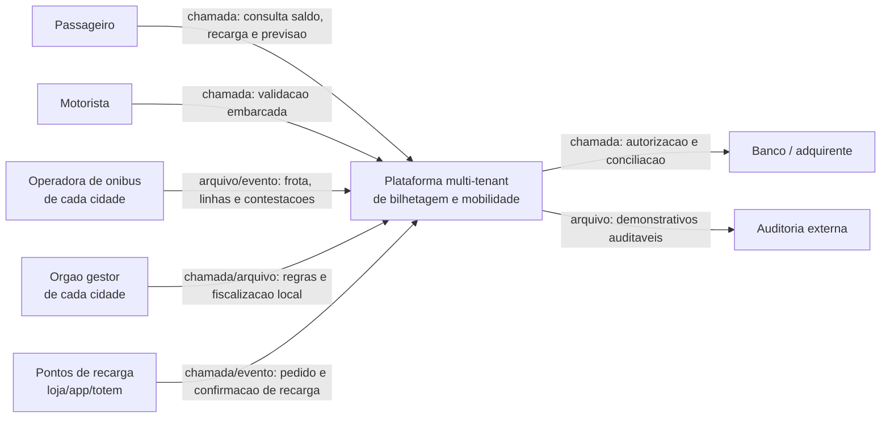

# C4 - Contexto

```mermaid
flowchart LR
    passageiro["Passageiro"]
    motorista["Motorista"]
    operador["Operadora de onibus\nde cada cidade"]
    gestor["Orgao gestor\nde cada cidade"]
    recarga["Pontos de recarga\nloja/app/totem"]
    banco["Banco / adquirente"]
    auditoria["Auditoria externa"]

    sistema["Plataforma multi-tenant\nde bilhetagem e mobilidade"]

    passageiro -- "chamada: consulta saldo, recarga e previsao" --> sistema
    motorista -- "chamada: validacao embarcada" --> sistema
    operador -- "arquivo/evento: frota, linhas e contestacoes" --> sistema
    gestor -- "chamada/arquivo: regras e fiscalizacao local" --> sistema
    recarga -- "chamada/evento: pedido e confirmacao de recarga" --> sistema
    sistema -- "chamada: autorizacao e conciliacao" --> banco
    sistema -- "arquivo: demonstrativos auditaveis" --> auditoria
```
